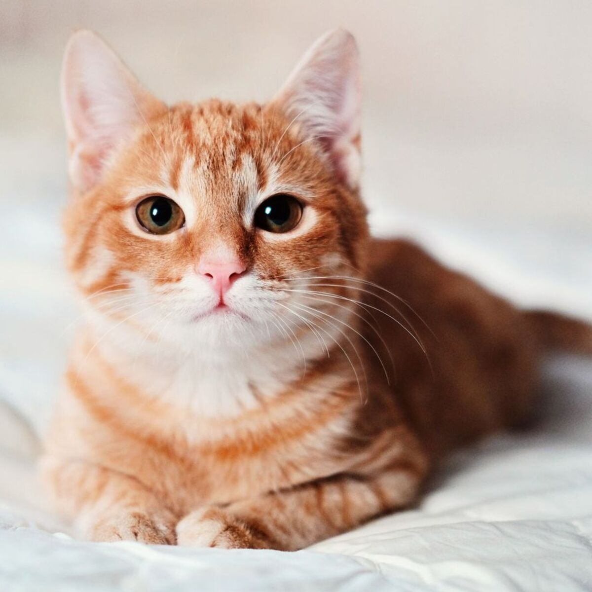

# PawDetect-CNN-for-Pet-Recognition

A Convolutional Neural Network (CNN) is a deep learning model used for image classification. It extracts spatial features using convolution and pooling layers, flattens the output, and classifies using dense layers. This binary CNN model differentiates between cats and dogs, utilizing ReLU activations, max pooling, and a sigmoid output layer. The dataset is stored in Google Drive (or Google Cloud Storage) and can be processed directly from there. Training and inference are demonstrated in Google Colab, leveraging cloud-based resources.

---

## Project Overview

* Mount Google Drive to access dataset files.
* Unzip the dataset only if not already extracted.
* Use Keras `ImageDataGenerator` to load and augment training and test images.
* Build a simple CNN architecture to classify images into two categories: cats and dogs.
* Train the model on the dataset.
* Upload and predict the class of a single image.

---

## File Structure

```
MyDrive/
└── dataset.zip           # Compressed dataset file
└── dataset/              # Extracted dataset folder
    ├── training_set/     # Training images (cats and dogs folders)
    └── test_set/         # Test images (cats and dogs folders)
```

---

## How to Run

1. Upload your dataset zip file (`dataset.zip`) to your Google Drive under `MyDrive`.(my dataset zip file was just too big to upload)

2. Open the provided notebook in Google Colab.

3. Run cells step-by-step:

   * Mount Google Drive.
   * Unzip the dataset if not already done.
   * Check the dataset folder structure.
   * Initialize image data generators for training and testing.
   * Build and compile the CNN model.
   * Train the CNN model.
   * Upload a new image and predict whether it is a cat or a dog.

---

## Dependencies

* TensorFlow (tested with TensorFlow 2.x)
* Keras (comes with TensorFlow 2.x)
* Google Colab environment
* Numpy
* Python 3.x

---

## Model Architecture

* Input: 64×64 RGB images
* Conv2D layer with 32 filters, 3×3 kernel, ReLU activation
* MaxPooling2D with 2×2 pool size
* Conv2D layer with 32 filters, 3×3 kernel, ReLU activation
* MaxPooling2D with 2×2 pool size
* Flatten layer
* Dense layer with 128 units and ReLU activation
* Dense output layer with 1 unit and sigmoid activation (binary classification)

---

## Notes

* The training and test dataset folders must contain subfolders named according to classes, e.g., `cats` and `dogs`.
* Images are resized to 64×64 for training.
* The model uses binary cross-entropy loss since there are two classes.
* Predictions print the class label based on a threshold of 0.5.

---

## Example Output

```
Found 8000 images belonging to 2 classes.
Found 2000 images belonging to 2 classes.
Epoch 1/10
...
Epoch 10/10
...
Class Indices: {'cats': 1, 'dogs': 0}
🧠 Prediction: This image is a cat.
```


*(Added this cute cat for testing, and the model predicted correctly.)*
---

## YAML Representation of Example Output

```yaml
example_output:
  training_images: 8000
  test_images: 2000
  epochs: 10
  class_indices:
    cats: 1
    dogs: 0
  sample_prediction:
    prediction_label: cat
    message: "🧠 Prediction: This image is a cat."
```

---

## License

This project is licensed under the GNU General Public License v3.0. You are free to use, modify, and distribute this software under the terms of the GNU GPL v3.0.

For more details, see the [LICENSE](LICENSE) file.


